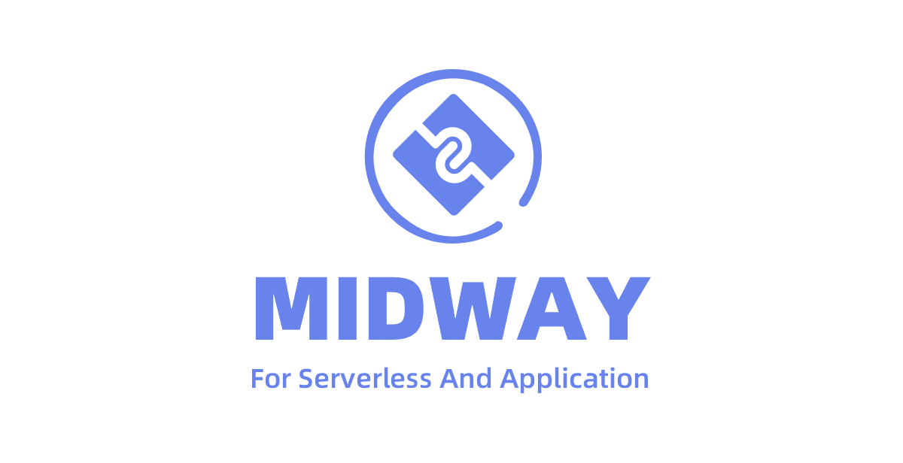

# Introduction

Bull is the legacy version of BullMQ. As it is still heavily used today, it is also maintained for bugs but not for new major features. If you want to use a battle-tested queue library and you do not need a better typescript integration nor the latest features you are good to go using this library for years to come.

#### Used by

Bull has been a part of the NodeJS ecosystem for a long time and is used by many organizations both in commercial and open-source projects. A few special mentions:

.png>).png>).webp>)

.png>)

