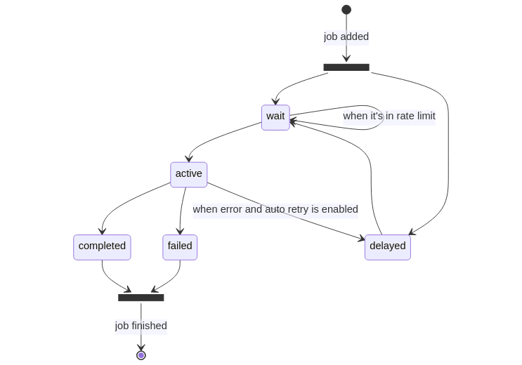

# Architecture

In order to use the full potential of Bull queues, it is important to understand the lifecycle of a job. From the moment a producer calls the [`add`](https://api.docs.bullmq.io/classes/Queue.html#add) method on a queue instance, a job enters a lifecycle where it will be in different states, until its completion or failure (although technically a failed job could be retried and get a new lifecycle).

When a job is added to a queue it can be in one of two states, it can either be in the “wait” status, which is, in fact, a waiting list, where all jobs must enter before they can be processed, or it can be in a “delayed” status: a delayed status implies that the job is waiting for some timeout or to be promoted for being processed, however, a delayed job will not be processed directly, instead it will be placed at the beginning of the waiting list and processed as soon as a worker is idle.

The next state for a job is the “active” state. The active state is represented by a set, and are jobs that are currently being processed, i.e. they are running in the `process` function explained in the previous chapter. A job can be in the active state for an unlimited amount of time until the process is completed or an exception is thrown so that the job will end in either the “completed” or the “failed” status.

Another way to add a job is by the [`add`](https://api.docs.bullmq.io/classes/FlowProducer.html#add) method on a flow producer instance.

.png>)

When a job is added by a flow producer, it can be in one of two states, it can either be in the “wait” status, when there aren't children, or it can be in a “waiting-children” status: a waiting-children status implies that the job is waiting for all its children to be completed, however, a waiting-children job will not be processed directly, instead it will be placed at the waiting list and processed as soon as the last child is marked as completed.
