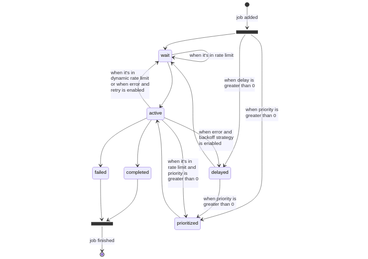
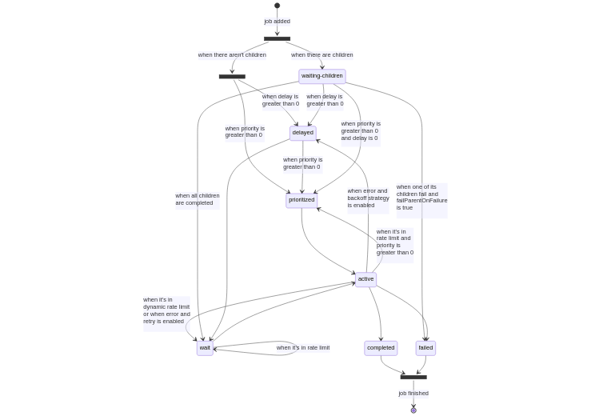

# Architecture

In order to use the full potential of Bull queues, it is important to understand the lifecycle of a job. From the moment a producer calls the [`add`](https://api.docs.bullmq.io/classes/v5.Queue.html#add) method on a `Queue` instance, a job enters a lifecycle where it will be in different states, until its completion or failure (although technically a failed job could be retried and get a new lifecycle).

<figure><figcaption>
Lifecycle of a job - Queue
</figcaption></figure>

When a job is added to a queue it can be in one of three states:
- **“wait”**: a waiting list, where all jobs must enter before they can be processed.
- **“prioritized”**: implies that a job with higher priority will be processed first.
- **“delayed”**: implies that the job is waiting for some timeout or to be promoted for being processed. These jobs are not processed directly, but instead are placed at the beginning of the waiting list, or in a prioritized set, and processed as soon as a worker is idle.


Note that priorities go from `0` to `2^21`, where 0 is the highest priority. This follows a similar standard as processed in Unix (https://en.wikipedia.org/wiki/Nice_(Unix), where a higher number means less priority).


The next state for a job is the **“active”** state. The active state is represented by a set, and are jobs that are currently being processed (i.e. they are running in the `process` function explained in the previous chapter). A job can be in the active state for an unlimited amount of time until the process is completed or an exception is thrown so that the job will end in either the **“completed”** or the **“failed”** status.

Another way to add a job is by the [`add`](https://api.docs.bullmq.io/classes/v5.FlowProducer.html#add) method on a flow producer instance.

<figure><figcaption>
Lifecycle of a job - Flow Producer
</figcaption></figure>

When a job is added by a flow producer, it can be in one of three states, it can either be in the **“wait”** or **“prioritized“** or **“delayed“** status, when there aren't children, or it can be in a **“waiting-children”** status: a waiting-children status implies that the job is waiting for all its children to be completed, however, a waiting-children job will not be processed directly, instead it will be placed at the waiting list or at delayed set (if `delay` is provided) or at prioritized set (if `delay` is 0 and `priority` is greater than 0) as soon as the last child is marked as completed.
