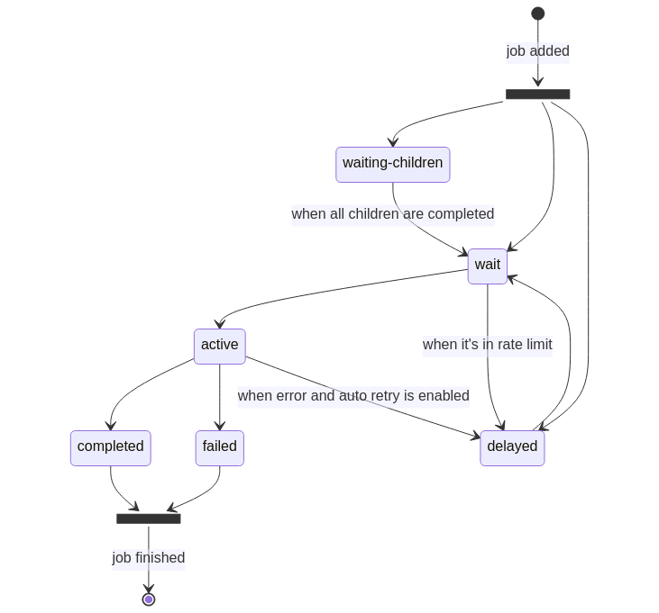

# Getters

When jobs are added to a queue, they will be in different statuses during their lifetime. BullMQ provides methods to retrieve information and jobs from the different statuses.



<!--
```mermaid
#stateDiagram-v2
state "waiting-children" as wc
state ja <<fork>>
state jf <<fork>>
    [*] - -> ja : job added
    ja - -> wc
    ja - -> wait
    ja - -> delayed
    wc - -> wait : when all children are completed
    wait - -> active
    wait - -> delayed : when it's in rate limit
    delayed - -> wait
    active - -> completed
    active - -> failed
    completed - -> jf
    failed - -> jf
    active - -> delayed : when error and auto retry is enabled
    jf - -> [*] : job finished
```
-->

#### Job Counts

It is often necessary to know how many jobs are in a given status:

```typescript
import { Queue } from 'bullmq';

const myQueue = new Queue('Paint');

const counts = await myQueue.getJobCounts('wait', 'completed', 'failed');

// Returns an object like this { wait: number, completed: number, failed: number }
```

The available status are: _completed, failed, delayed, active, wait, paused_ and _repeat._

#### Get Jobs

It is also possible to retrieve the jobs with pagination style semantics. For example:

```typescript
const completed = await myQueue.getJobs(['completed'], 0, 100, true);

// returns the oldest 100 jobs
```
