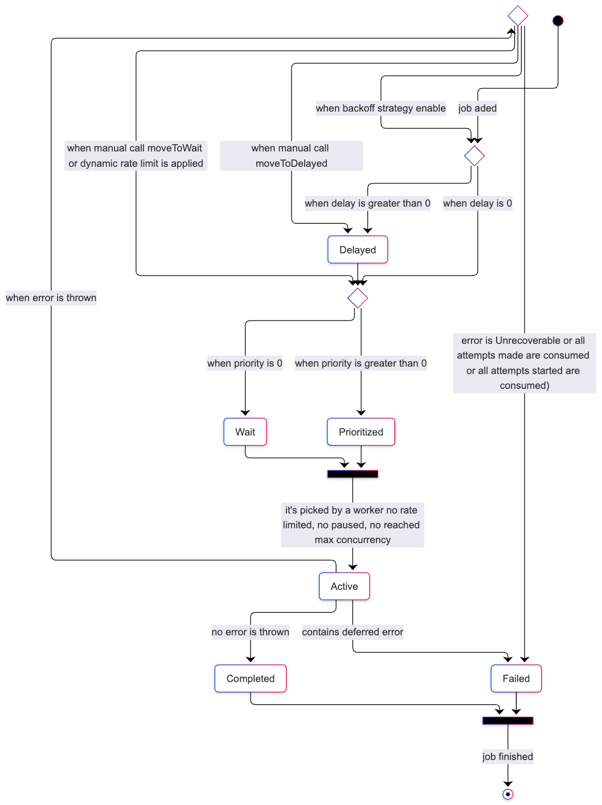

# Getters

When jobs are added to a queue, they will be in different statuses during their lifetime. BullMQ provides methods to retrieve information and jobs from the different statuses.

<figure><figcaption><p>Lifecycle of a job</p></figcaption></figure>

#### Job Counts

It is often necessary to know how many jobs are in a given status:




```typescript
import { Queue } from 'bullmq';

const myQueue = new Queue('Paint');

const counts = await myQueue.getJobCounts('wait', 'completed', 'failed');

// Returns an object like this { wait: number, completed: number, failed: number }
```





```python
from bullmq import Queue

myQueue = Queue('Paint')

counts = await myQueue.getJobCounts('wait', 'completed', 'failed')

# Returns an object like this { wait: number, completed: number, failed: number }
```




The available status are:
- _completed_,
- _failed_,
- _delayed_,
- _active_,
- _wait_,
- _waiting-children_,
- _prioritized_,
- _paused_, and
- _repeat_.

#### Get Jobs

It is also possible to retrieve the jobs with pagination style semantics. For example:




```typescript
const completed = await myQueue.getJobs(['completed'], 0, 100, true);

// returns the oldest 100 jobs
```





```python
completed = await myQueue.getJobs(['completed'], 0, 100, True)

# returns the oldest 100 jobs
```




## Read more:

* 💡 [Get Job Counts API Reference](https://api.docs.bullmq.io/classes/v5.Queue.html#getjobcounts)
* 💡 [Get Jobs API Reference](https://api.docs.bullmq.io/classes/v5.Queue.html#getjobs)
