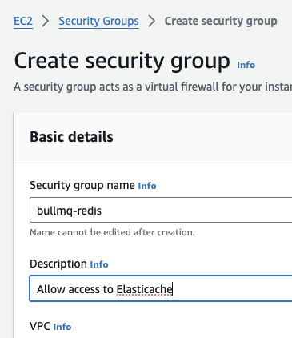

# Getters

When jobs are added to a queue, they will be in different statuses during their lifetime. BullMQ provides methods to retrieve information and jobs from the different statuses.




#### Job Counts

It is often necessary to know how many jobs are in a given status:

```typescript
import { Queue } from 'bullmq'

const myQueue = new Queue('Paint');

const counts = await myQueue.getJobCounts('wait', 'completed', 'failed');

// Returns an object like this { wait: number, completed: number, failed: number }
```

The available status are: _completed, failed, delayed, active, wait, paused _and_ repeat._

#### Get Jobs

It is also possible to retrieve the jobs with pagination style semantics. For example:

```typescript
const completed = await myQueue.getJobs(['completed'], 0, 100, true);

// returns the oldest 100 jobs
```

